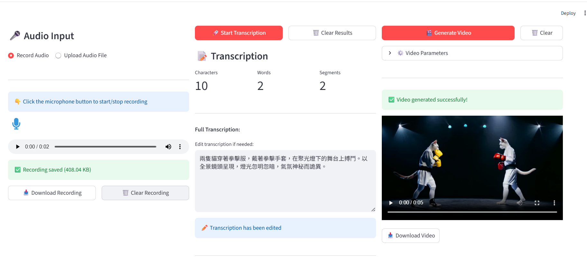

# Audio2Video

## 概述

Audio2Video 是一個將音頻輸入轉換成視頻輸出的 AI 應用程式，提供直覺的 Web 介面和命令列工具。

**核心功能：**
1. **音頻轉文字轉錄**：採用 OpenAI Whisper Large v3 模型，將語音轉錄成文字
2. **文字生成視頻**：使用 Wan2.1-T2V-1.3B 擴散模型，根據文字生成 AI 影片
3. **Web 介面**：基於 Streamlit 的互動式前端，支援錄音、上傳、即時預覽
4. **實驗系統**：系統性測試與性能評估工具，包含自動化測試腳本與報告生成

<p align="center">
  
</p>

## 安裝

### 系統需求

- Python 3.8+
- CUDA 11.8+ (建議使用 GPU)
- 16GB+ RAM
- 8GB+ GPU VRAM (啟用量化) 或 16GB+ (完整精度)

### 安裝步驟

```bash
# 安裝依賴套件
pip install -r requirements.txt
```

## 使用說明

### 方式 1：Web 介面（推薦）

啟動 Streamlit Web 應用程式：

```bash
streamlit run app.py
```

應用程式會在 `http://localhost:8501` 啟動。

#### Web 介面使用流程

1. **錄音或上傳音檔**
   - 點擊麥克風圖示即時錄音，或
   - 選擇「Upload Audio File」上傳 MP3/WAV 檔案

2. **轉錄音檔**
   - 點擊「🚀 Start Transcription」按鈕
   - 等待 Whisper 模型完成轉錄
   - 可編輯轉錄文字內容

3. **生成影片**
   - 點擊「🎬 Generate Video」
   - 可展開「⚙️ Video Parameters」調整參數
   - 等待 AI 生成影片
   - 預覽並下載影片

#### Web 介面特色

- ✅ 即時錄音功能
- ✅ 影片預覽播放
- ✅ 一鍵下載結果

### 方式 2：命令列工具

適合批次處理或自動化腳本使用。

#### 步驟 0：準備音頻

可從 YouTube 下載音檔：[YouTube to MP3](https://yt1s.ai/zh-tw/youtube-to-mp3/)

#### 步驟 1：音頻轉文字轉錄

使用 Whisper-large-v3 模型，將音頻檔案轉錄成 JSON 格式的文字結果。

```bash
python utils/audio2text.py --audio_file path/to/audio.mp3 --output_dir results/
```

- `--audio_file`：輸入音頻檔案路徑（預設：`data/1000.mp3`）。
- `--output_dir`：文字轉錄結果保存資料夾（預設：`results`）。

#### 步驟 2：文字生成視頻

使用 Wan2.1-T2V-1.3B 擴散模型，根據文字提示生成視頻。

```bash
python utils/text2vedio.py --text_file results/1000_transcription.json --output_dir results/ --duration 3.0 --fps 16
```

**參數說明：**

- `--text_file`：輸入文字檔案路徑（支援 JSON 或純文字格式，預設：`results/1000_transcription.json`）
- `--output_dir`：生成視頻的輸出目錄（預設：`results/`）
- `--duration`：視頻時長（秒），預設：`3.0` 秒
- `--fps`：每秒幀數（frames per second），預設：`16`

**範例：**

```bash
# 生成 3 秒視頻（16 fps = 48 frames）
python utils/text2vedio.py --text_file results/1000_transcription.json --duration 3.0

# 生成 5 秒視頻（16 fps = 80 frames）
python utils/text2vedio.py --text_file results/1000_transcription.json --duration 5.0

# 使用自訂 fps
python utils/text2vedio.py --text_file results/1000_transcription.json --duration 3.0 --fps 24
```

## 專案結構

```
audio2vedio/
├── app.py                      # Streamlit Web 應用程式入口
├── requirements.txt            # Python 依賴套件清單
├── config/
│   └── settings.yaml          # 應用程式配置檔
├── components/                 # 前端 UI 元件
│   ├── audio_input.py         # 音頻輸入元件（錄音/上傳）
│   ├── transcription.py       # 轉錄顯示與編輯元件
│   └── video_generator.py     # 影片生成與參數控制元件
├── backend/
│   └── pipeline.py            # 後端處理流程整合
├── utils/                      # 核心功能模組
│   ├── audio2text.py          # Whisper 語音轉錄
│   └── text2vedio.py          # Wan2.1 影片生成
├── experiments/                # 實驗與系統性測試
│   ├── README.md              # 實驗說明文件
│   ├── EXPERIMENT_SUMMARY.md  # 實驗總結與快速指南
│   ├── test_video_generation.py  # 完整影片生成測試（6個測試）
│   ├── quick_test.py          # 快速單一測試腳本
│   └── results/               # 實驗結果輸出（影片、日誌、報告）
├── data/                       # 輸入音頻檔案目錄
├── results/                    # 輸出結果目錄（轉錄 JSON + 影片）
├── logs/                       # 日誌檔案
└── tests/                      # 測試案例

```

## 核心元件介紹

### 1. Web 應用程式 (`app.py`)

主要的 Streamlit 應用程式，提供三欄式介面：
- **第一欄**：音頻輸入（錄音/上傳）
- **第二欄**：轉錄顯示與編輯
- **第三欄**：影片生成與預覽

特色功能：
- 模型快取機制（避免重複載入）
- 即時進度更新

### 2. 前端元件 (`components/`)

#### `audio_input.py` - 音頻輸入元件
- 支援即時錄音（使用 `audio-recorder-streamlit`）
- 支援檔案上傳（MP3, WAV, M4A, FLAC）
- 音頻預聽功能
- 下載與清除錄音

#### `transcription.py` - 轉錄元件
- 顯示轉錄文字與統計資訊
- 可編輯的文字編輯器
- 下載 JSON 格式轉錄結果
- 轉錄控制按鈕

#### `video_generator.py` - 影片生成元件
- 影片參數控制（時長、FPS）
- 可摺疊的參數設定面板
- 影片預覽播放器
- 效能監控儀表板（GPU/CPU 使用率、記憶體）
- 影片下載功能

### 3. 後端處理 (`backend/pipeline.py`)

整合音頻轉錄與影片生成的完整流程：
- **模型懶載入**：僅在需要時載入模型
- **進度回調**：支援前端即時顯示進度
- **錯誤處理**：完善的異常捕捉與記錄
- **資源管理**：自動清理暫存檔案

主要方法：
```python
pipeline = Audio2VideoPipeline(config)

# 轉錄音頻
transcription = pipeline.transcribe_audio(audio_path)

# 生成影片
video_path, stats = pipeline.generate_video(text, duration, fps)

# 完整流程
results = pipeline.run_full_pipeline(audio_path)
```

### 4. 核心工具 (`utils/`)

#### `audio2text.py` - Whisper 語音轉錄
- 模型：OpenAI Whisper Large v3
- 輸出：文字 + 時間戳分段
- 自動 GPU/CPU 偵測
- Float16 精度優化

#### `text2vedio.py` - Wan2.1 影片生成
- 模型：Wan-AI/Wan2.1-T2V-1.3B
- 支援 4-bit 量化（節省 50% VRAM）
- 效能監控（記憶體、GPU 使用率、生成時間）
- 可調參數：duration、fps

### 5. 配置系統 (`config/settings.yaml`)

集中管理所有配置：
- 音頻設定（支援格式、最大時長）
- 模型設定（模型名稱、裝置選擇）
- 影片參數預設值
- UI 設定（主題、布局）

### 6. 實驗系統 (`experiments/`)

系統性測試影片生成模組的性能與品質。

#### 實驗設計理念

每個測試提示詞包含三個核心元素：
- **物體 (Object)**：主要視覺焦點（如跑車、小鳥、太空人）
- **場景 (Scene)**：環境背景（如城市街道、森林、太空站）
- **動作 (Action)**：動態行為（如行駛、飛翔、漂浮）

#### 測試腳本

**`quick_test.py` - 快速測試**
- 生成單一 5 秒測試影片
- 快速驗證環境配置
- 適合新手測試

**`test_video_generation.py` - 完整實驗**
- 測試矩陣：2 種時長 × 3 個提示詞 = 6 個測試
- 自動生成詳細報告
- 性能統計與 GPU 記憶體分析

#### 使用方法

```bash
# 快速測試（1個影片）
python experiments/quick_test.py

# 完整實驗（6個影片，需 15-30 分鐘）
python experiments/test_video_generation.py
```

#### 輸出結果

實驗結果保存在 [experiments/results/](experiments/results/):
- `videos/` - 生成的影片檔案
- `logs/` - 每個測試的 JSON 詳細記錄
- `REPORT.md` - 自動生成的總結報告
- `full_results.json` - 完整測試數據

詳細說明請參考 [experiments/README.md](experiments/README.md) 和 [experiments/EXPERIMENT_SUMMARY.md](experiments/EXPERIMENT_SUMMARY.md)。

## 配置說明

編輯 `config/settings.yaml` 自訂應用程式行為：

```yaml
# 影片生成預設值
video:
  default_duration: 3.0
  default_fps: 16
  quantization: false  # 啟用 4-bit 量化

# 效能設定
performance:
  cache_models: true
  clear_cuda_cache: true
```

## 效能優化建議

### 提升速度
- ✅ 使用 GPU（必要）
- ✅ 降低 FPS（16 為最佳平衡）
- ✅ 縮短影片時長

### 節省記憶體
- ✅ 在 `config/settings.yaml` 啟用 `quantization: true`
- ✅ 降低 FPS 或時長
- ✅ 關閉其他 GPU 程式

## 故障排除

### CUDA out of memory
```bash
# 解決方案 1: 啟用量化
# 編輯 config/settings.yaml，設定 quantization: true

# 解決方案 2: 清理 GPU 快取
python -c "import torch; torch.cuda.empty_cache()"
```

### 模組未找到
```bash
pip install -r requirements.txt --upgrade
```

## 技術規格

| 元件 | 技術 | 用途 |
|------|------|------|
| 前端框架 | Streamlit | Web UI |
| 語音轉錄 | Whisper Large v3 | 音頻 → 文字 |
| 影片生成 | Wan2.1-T2V-1.3B | 文字 → 影片 |
| 深度學習 | PyTorch + CUDA | GPU 加速 |
| 錄音元件 | audio-recorder-streamlit | 瀏覽器錄音 |
| 視覺化 | Plotly | 效能圖表 |

## 授權

本專案整合以下開源技術：
- [Streamlit](https://streamlit.io/) - Apache 2.0
- [OpenAI Whisper](https://github.com/openai/whisper) - MIT
- [Wan-AI Models](https://huggingface.co/Wan-AI) - Model License